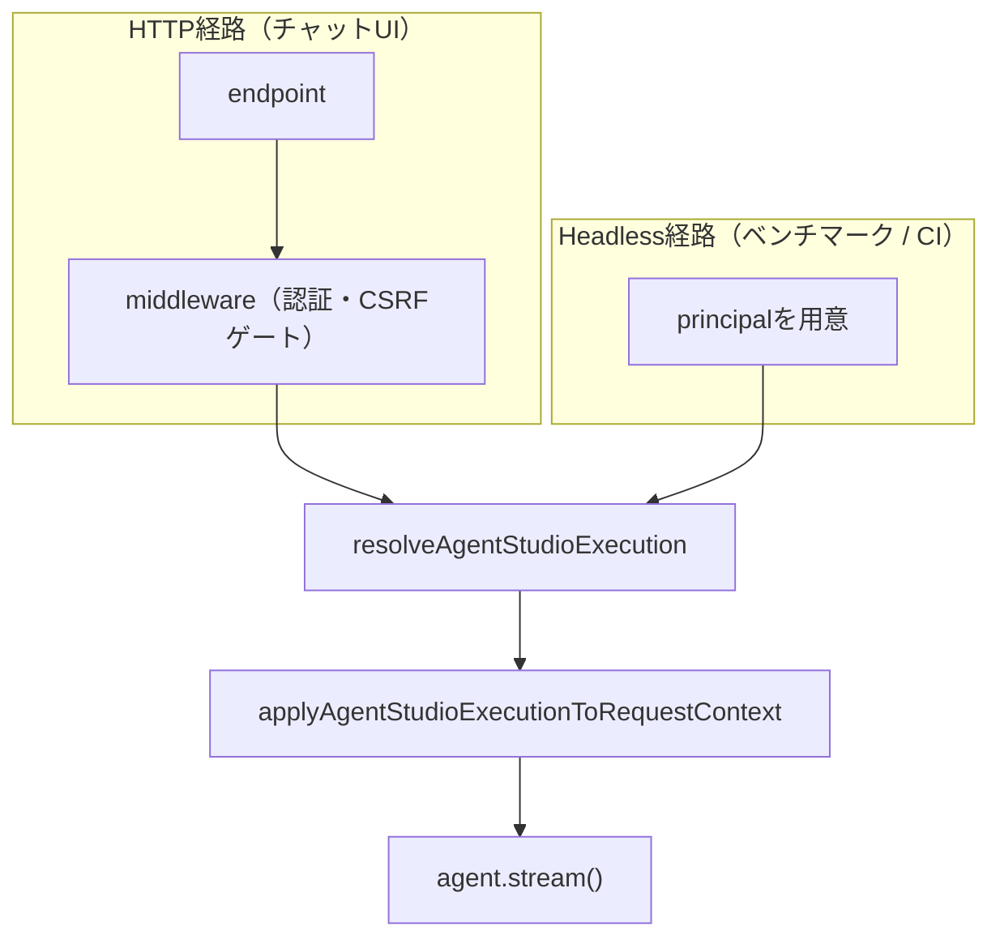

# プレイドインターン体験記：KARTEのAIエージェント評価基盤を1から設計・実装した話

こんにちは。2026年8月から9月末までの約2か月間、プレイドのKARTE AIチームでインターンに参加していた後藤健一郎です。

インターンでは、KARTE上でAIエージェントを作成・運用できる「Agent Studio（β版）」の評価基盤を設計・実装しました。エージェントの変更が品質にどう影響するかを、本番と同じ実行経路で確かめられるようにするための仕組みです。

この記事では、評価基盤が必要になった背景と設計、実装で悩んだ点、ベンチマークを動かして見つかった問題を書きます。

## プレイドに参加したきっかけ

応募のきっかけは2つあります。

1つは、Rustのメンテナをされているlaplaさんの個人ブログで、プレイドが良い会社だと紹介されていたのを読んだことです。

もう1つは、自分のやりたいこととの一致です。私はソフトウェアエンジニアリングとAIの中間のような領域に取り組みたいと考えていました。プレイドは「人とAIが協働するCXプラットフォーム」という方針を掲げ、1st Party Customer Dataをリアルタイムに解析する基盤を持っています。面接を重ねる中で、データとAI、プロダクトエンジニアリングが交わる場所で開発できる点に惹かれました。

## KARTEとAgent Studio

KARTEは、顧客行動データを活用してCX（顧客体験）を改善するプラットフォームです。Webやアプリのリアルタイム行動データと、外部データをユーザー軸で統合し、施策の実行までを支えます。
その上で開発が進んでいるのが、AIエージェント基盤のAgent Studio（β版）です。自然言語で指示を出すと、AIが必要な情報を動的に取得し、分析から施策の生成・実行までを行います。ユーザー自身がエージェントを作成し、役割や制約を定義できる点が特徴です。
Agent Studioのエージェントは、Mastraをベースに、モデル、システムプロンプト、ツール、サブエージェントといった設定を組み合わせて作ります。モデルの選択やプロンプトの調整は品質に大きく影響しますが、その変更が本当に良かったのかを確かめる手段がありませんでした。そこで私が担当したのが、エージェントを定量的に評価する基盤です。

## インターン序盤に取り組んだこと

インターンは、ローカル開発環境の構築から始まりました。KARTEは複数のシステムが連携する大きなコードベースなので、環境構築だけでも学ぶことが多く、トラブルシューティングの内容を一つずつIssueに残しながら進めました。

// comment: この下の本筋ではないタスクについての記述は必要ない気がしている。
その後に取り組んだのが、チャット応答の出力トークン数に上限を設けるタスクです。Agent Studioのチャットは、長いコードや分析結果を生成する用途を想定しています。一方で上限がないと、不必要に長い生成によって遅延とコストが増え、使い勝手を損なう可能性があります。

実装では、エージェントの生成パラメータにmaxOutputTokensを追加しました。通常は10,000トークン、ClaudeのReasoningを有効にした場合はthinkingの予算を加味して20,000トークンです。上限に達するとfinishReasonがlengthやmax_tokensになるため、その条件でDatadogに構造化ログを出し、Slackにも通知するようにしました。

閾値を決める際は、Datadogに残っていたこれまでの出力トークンの分布を確認しました。大半が数百から数千トークンで、10,000を超えるチャットはほとんどありません。既存実装で使われていた値を参考にしつつ、実際の利用状況に基づいて決めました。推測ではなく、観測できるデータを見てから決めるという進め方を学びました。

この変更は、上限を入れるPRと、超過を観測するPRの2つに分けて出しました。レビューしやすい単位に分割し、観測の仕組みを先に用意してから影響を判断する進め方も印象に残っています。このほか、不要になったマイグレーションコードの撤去など、小さめのタスクも並行して担当しました。

## エージェント評価基盤の構築

### なぜ評価基盤が必要だったのか

まず、社内の検証環境で固定のエージェントテンプレートを評価できるようにすることがゴールとして設定されました。モデルを変えたときに品質がどう変わるか、プロンプトを変えたときに期待した振る舞いをするかを比較したいという目的です。
Agent Studioは未だ開発途中の段階です。そのため、様々な改修を行うことが見越されましたが、その変更の妥当性を定量的に計測するための仕組みが必要だということで実装方針を固めていきました。

検討を進める中で、最初の壁にぶつかりました。本番のエージェント実行は、HTTPエンドポイントへのリクエストを起点に、認証と認可を経て実行される経路になっています。

```txt
endpoint
→ middleware（認証・CSRFゲート）
→ 認可・config / tree / toolの解決
→ agent.stream()
```

この経路をブラウザの外から辿るには認証情報が必要になります。ベンチマークをターミナルやCIから動かしたいのに、その手段がコードベースに存在しない状態でした。

### 何を評価するかを決める

評価の設計では、シナリオをJSONで定義することにしました。シナリオには、エージェントのinstruction、許可するツール、期待するツール呼び出し、実行後のDB状態の期待値、ユーザーの入力メッセージなどを書きます。
評価設計には [Demestifying evals for AI Agents - Anthropic](https://www.anthropic.com/engineering/demystifying-evals-for-ai-agents#:~:text=Evaluating%20conversational%20agents) を強く参考にしました。
記事内では、Agentic systemの評価は

- 実行終了時の状態
- タスクが完了したかどうかとその品質

以上の2つの側面から評価すること重要だとされています。なので、終了後のDBなどのstatefulなコンポーネントの静的検証と [Evals - Mastra](https://mastra.ai/docs/evals/overview) でのLLM-as-a-judgeによる評価の両方が必要になります。

```json
{
  "name": "セグメント管理アシスタント",
  "instruction": "…",
  "allowedTools": {
    "listSegments": { "params": {} },
    "createSegment": { "params": {} }
  },
  "expectedToolCalls": [
    { "name": "listSegments" },
    { "name": "createSegment", "args": { "name": "…" } }
  ],
  "stateChecks": [
    { "type": "state_check", "expect": { "segments": { "name": "…" } } }
  ],
  "messages": [
    { "role": "user", "content": "現状のセグメントを確認し、…を作成してください。" }
  ]
}
```

指標は次の4つのグループに分けました。

| グループ | 指標 | 見ているもの |
| --- | --- | --- |
| Overall | Task Success / pass^3 | シナリオ単位の成否と、複数回実行での安定性 |
| Correctness / Behavior | Tool call Accuracy（Selection / Arguments）、State Correctness | ツール選択・引数の正しさと、DB状態が期待どおりか |
| Response Quality | Answer Relevancy / Completeness | 回答の関連性と網羅性（LLMによる評価） |
| Efficiency / Reliability | Tool Error Rate、Token / Task、Tool Calls / Task | ツールエラーの少なさと処理の効率 |

Task Successは、ツール選択、引数、DB状態、ツールエラー率などを総合して判定します。pass^3は同じシナリオを3回実行してすべて成功した割合で、エージェントの再現性を見るために入れました。コストやレイテンシの分位点も検討しましたが、コストはトークン数から推定できること、速度は今回の主目的ではないことから、初版の指標には含めませんでした。何を測らないかを決めるのも設計のうちだと感じました。

### HTTPを介さずにエージェントを実行できるようにする

評価基盤の前提として、本番と同じ実行経路を認証なしで関数として呼び出せるようにする必要がありました。ここで大事にしたのは、本番のチャットとベンチマークで実行ロジックを二重に持たないことです。同じコードを通るからこそ、ベンチマークの結果が本番の挙動を表すと言えます。

そこで、実行コンテキストの解決をHTTPミドルウェアから切り出しました。

| 処理 | 変更 |
| --- | --- |
| principalの取得、CSRF / callerSourceゲート | HTTPミドルウェア（従来どおり） |
| 認可・config / tree / toolの解決 | resolveAgentStudioExecution |
| 解決結果のRequestContextへの書き込み | applyAgentStudioExecutionToRequestContext |
| エージェント本体とagent.stream() | 変更なし |

ゲートはHTTP、解決は関数、という責務の分離を意識しました。呼び出し側では次のようになるイメージです。

```ts
const execution = await resolveAgentStudioExecution({
  principal: { account, project, role },
  agentConfigId,
});
applyAgentStudioExecutionToRequestContext(requestContext, {
  principal,
  execution,
});
agent.stream(…);
```



このリファクタリングは、レビューでのやり取りを通して形が変わりました。当初はmiddlewareの近くに置いていましたが、HTTPに依存しないロジックはlib配下に置く方が責務がはっきりするという指摘を受け、配置を移しました。
逆に、resolveの内部にroute側への依存が残っている点は、既存コードの問題が大きいため、今回のスコープでは直さず別Issueとして切り出しました。
タスクの責務や変更範囲はAIがなければインターン期間内の実装が不可能なほど大きいものでした。AIを使った実装では手で行うコーディングとは異なる点に気を遣う必要がありますが、その中でも完璧な設計を目指して変更を広げるのではなく、今回の目的に必要な分だけを動かすという判断に特に気を遣いました。


// comment: いらないような気がする
また、レビューでは「この関数は外部公開のゲートを検査しない。ゲートは呼び出し側の責務」という前提をJSDocに明記するよう指摘を受けました。ヘッドレス経路が増えると、どこで何を守るのかが曖昧になりがちです。責務の境界をコメントとして残すことの重要性を実感しました。

### ベンチマークCLIとスコアリング

評価の実行はCLIから行えるようにしました。全シナリオをまとめて回す場合と、個別のシナリオだけを回す場合の2つを用意しています。

```bash
make run-agent-benchmark
AGENT_STUDIO_CONFIG=benchmark/scenarios/segment-management-assistant.json \
  make run-individual-agent-benchmark
```

スコアリングは、ツール呼び出しの採点、応答品質の評価、実行効率の集計、シナリオ全体の成功判定といった単位で小さな純粋関数に分割しました。エージェントの実行そのものはテストが難しくても、採点ロジックは入力と出力が決まればテストできます。単体テストを厚く書いたことで、集計や整形のミスに早く気づけました。

実行後は、ベンチマーク用に投入したデータをfixture投入直後の状態に戻します。ツールがDBを書き換えるため、後片付けをしないと次の実行結果が変わってしまうからです。ここはレビューでも設計が妥当かを確認してもらったポイントでした。

出力は次のような形式です。

```txt
Agent Studio benchmark
config  all scenarios (4)

Overall Average
  Task Success                           66.7%
  pass^3                                 50.0%

Correctness / Behavior
  Tool call Accuracy / Selection         79.2%
  Tool call Accuracy / Arguments         83.3%
  State Correctness                     100.0%

Response Quality
  Answer Relevancy                        0.58
  Completeness                            0.45

Efficiency / Reliability
  Tool Error Rate                        23.8%
  Token / Task (k)                       110.4
  Tool Calls / Task                       3.58
```

数値は開発中のある時点での実行例です。同じ設定で繰り返し実行して比較できるようになったことで、モデルやプロンプトの変更を数値で議論できるようになりました。これが今回の一番の成果です。

### ベンチマーク自身の問題と改善

// 具体的すぎるような、、
評価基盤を作ると、評価基盤自体の問題も見つかります。一部のシナリオでOverallがn/aと表示され、成功可否が判定されない問題がありました。判定に必要な値が欠けているときの扱いを見直し、修正しました。

もう1つは、レビューで指摘された、Tool Error Rateが成功判定に含まれていない問題です。あるシナリオではTask Successが100%なのに、Tool Error Rateが75%になっていました。ツールが失敗していても成功と判定されていたわけです。成功条件にツールエラー率を組み込むことで、実態に合う判定に修正しました。数値を眺めているだけでは気づきにくく、レビューで別の目が入ることの大切さを実感した出来事でした。

モデルを比べるための設定も追加し、同じシナリオを複数のモデルで実行して比較できるようにしました。

## レビューと開発プロセスから学んだこと

// これも具体的に書かない方がいいような
プレイドの開発では、PRの説明に「目的」「実装方針」「テスト方法」「見て欲しいポイント」を書くのが慣例です。この形式は、自分の変更を説明する訓練になりました。「見て欲しいポイント」を書くと、レビューしてほしい範囲が明確になり、レイヤー間の依存関係の分離のような判断が難しい部分に的確なフィードバックをもらえました。

レビューは人間だけでなく、AIによる自動レビューも入ります。SentryのBug PredictionやGitHub Actions上のレビューエージェントが指摘をくれます。中には、既存の挙動と等価だから問題ないといった、こちらで確認して説明する必要がある指摘もありました。AIの指摘をそのまま適用するのではなく、コードを読んで自分の言葉で可否を判断する使い方を学びました。

## インターンを通して

約2か月間、インターン生というより1人の開発メンバーとして扱ってもらえたのが印象に残っています。検証環境での確認からデプロイの依頼まで、必要な手順を教わりながら、実際のプロダクトと同じリポジトリで開発できました。

一方で、自走することは求められました。特に今回のようなAgentic systemの評価というのは、同じことをやっている事例もそう多くない新しい領域のタスクです。質問すればメンターやチームの皆さんが丁寧に答えてくれたので、詰まっても前に進めました。評価基盤は最初から仕様が決まっていたわけではなく、設計の途中で何度も方針を相談しながら作っていきました。判断に迷う場面では、自分自身がツールの仕組みや役割を理解し「なぜその実装をするのか」を説明できる状態にしておくことが重要だと感じました。

## これからインターンに挑戦する方へ

プレイドでは、インターン生でもプロダクトの課題に本気で取り組めます。今回の評価基盤のように、正解が決まっていないテーマを自分で設計し、レビューを受けながら形にする経験は、なかなかできるものではないと思います。

AIとソフトウェアエンジニアリングの両方に関わりたい人、大規模なデータとプロダクトの開発を経験したい人には、とても良い環境です。興味がある方は、ぜひ応募してみてください。

下記リンクから応募できます。
https://plaid-newgrads.snar.jp/jobboard/detail.aspx?id=2B9662ZbwLU

$$
math
$$

$a_n$
